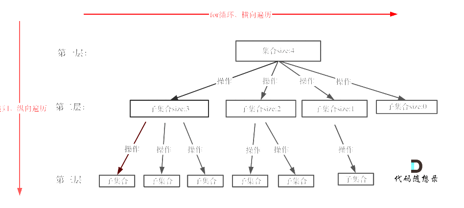

# 代码随想录
~~~
计划 : 因为之前已经做过很多了,所以进度要快一些
数组 : 8 / 17  -- 8 / 17 完成
链表 : 8 / 18  -- 8 / 17 完成
哈希表 : 8 / 19 -- 8 / 18完成
字符串 : 8 / 20  -- 8 / 19完成
双指针 : 8 / 21  -- 8 / 19完成
栈与队列 : 8 / 22 -- 8 / 20完成
二叉树 : 8 / 23 - 8 / 24 -- 8 / 24凌晨完成
回溯算法 : 8 / 25 - 8 / 26
贪心 : 8 / 27 - 8 / 28
动态规划 : 8 / 29 - 8 / 31

单调栈 和 额外题目 : 9 / 1 - 9 / 3
~~~
## Array

### 704. 二分查找...
~~~
class Solution {
public:
    int search(vector<int>& nums, int target) {
        int left = 0;int right = nums.size()-1;
        
        while(left <= right)
        {
            int mid = (left + right) / 2;
            if(nums[mid] == target){
                return mid;
            }else if(nums[mid] > target){
                right = mid-1;
            }else{
                left = mid + 1;
            }
        }
        return -1;
    }
};
~~~

### 27.移除元素
思路一 : 双指针法
~~~
class Solution {
public:
    void swap(int&a,int&b){int tmp = a;a = b;b =tmp;}
    int removeElement(vector<int>& nums, int val) {
        int left = 0;int right = nums.size() - 1;
        while(right >= 0 && left < nums.size() && left < right)
        {
            while(left < nums.size() && nums[left] != val ){
                left++;
            }

            while(right >= 0 && nums[right] == val ){
                right--;
            }

            if(left < right)
                swap(nums[left],nums[right]);
        }

        int count = 0;
        while(count < nums.size() && nums[count] != val){
            count++;
        }

        return count;
    }
};
~~~
这里是前后两个指针,有时候会用到快慢两个指针...感觉快慢指针用起来可能方便一些..
以后可以试试

### 997.有序数组的平方
给你一个按 非递减顺序 排序的整数数组 nums，返回 每个数字的平方 组成的新数组，要求也按 非递减顺序 排序。

思路1 : 还是双指针,left指向非负,right指向负
~~~
class Solution {
public:
    vector<int> sortedSquares(vector<int>& nums) {
        if(nums.empty())
        {
            return {};
        }
        vector<int>res;
        //感觉还是双指针...
        //left指向绝对值最小的负数,right指向绝对值小的非负数.
        //比较绝对值的大小...

        int left = 0,right = 0;
        //寻找第一个非负数
        while(right < nums.size() && nums[right] < 0){
            right++;
        }
        if(right == 0)//数组为空或者从第一个开始就是非负数
        {
            for(auto v : nums){
                res.push_back(pow(v,2));
            }
            return res;
        }
        else if(right == nums.size())
        {
            //数组为空或者数组全部是负数
            for(auto v : nums){
                res.push_back(pow(v,2));
            }
            //颠倒一下
            reverse(res.begin(),res.end());
            return res;
        }
        else //有正有负
        {
            left = right - 1;//left 指向绝对值最小的负数
            while(left >= 0 && right < nums.size())
            {
                if(abs(nums[left]) < abs(nums[right]))
                {
                    res.push_back(pow(nums[left--],2));
                }
                else
                {
                    res.push_back(pow(nums[right++],2));
                }
            }

            while(left >= 0){
                res.push_back(pow(nums[left--],2));
            }
            while(right < nums.size()){
                res.push_back(pow(nums[right++],2));
            }

            return res;
        }

    }
};
~~~
这样的写法繁琐了...从中间开始判断增加了很多冗余的判断,事实上我们可以从两端开始周三后.会方便很多...
~~~
class Solution {
public:
    vector<int> sortedSquares(vector<int>& nums) {
        if(nums.empty())
        {
            return {};
        }
        vector<int>res(nums.size());
        int index = nums.size() -1;
        //感觉还是双指针...
        //left指向绝对值最小的负数,right指向绝对值小的非负数.
        //比较绝对值的大小...
        //从两端开始
        int left = 0;int right = nums.size() - 1;
        
        while(left < nums.size() && right >= 0 && left <= right)
        {
            if(abs(nums[left]) < abs(nums[right])){
                res[index--] = (nums[right] * nums[right]);
                right--;
            }else{
                res[index--] = (nums[left] * nums[left]);
                left++;
            }
        }
        
        return res;

    }
};
~~~

### 209.长度最小的子数组
给定一个含有 n 个正整数的数组和一个正整数 target 。

找出该数组中满足其和 ≥ target 的长度最小的 连续子数组 [numsl, numsl+1, ..., numsr-1, numsr] ，并返回其长度。如果不存在符合条件的子数组，返回 0 。

思路一 : 滑动窗口
~~~
class Solution {
public:
    //返回和 >= target的长度最小的连续子数组
    //关键词 : 连续
    //暴力 : 一次以每个元素开头,计算最小子数组的长度,返回最小值
    //滑动窗口 : 有窗口头,和窗口尾,两个状态 : 如果总长度够了 , 头 + 1, 长度不够,尾长度 + 1,且当前的窗口总行度增加
    int minSubArrayLen(int target, vector<int>& nums) {
        if(nums.empty())
            return 0;
        if(accumulate(nums.begin(),nums.end(),0) < target)
            return 0;
        
        int left = 0, right = 0,cur_sum = 0;
        int min_len = INT_MAX;
        cur_sum = nums[left];

        while(right < nums.size())
        {
            if(cur_sum < target)
            {
                //是否有增长的能力
                if(right + 1 >= nums.size()){
                    return min_len;
                }else{
                    cur_sum += nums[++right];
                }
            }
            else // >= target
            {
                //是否是最小值
                min_len = (right - left + 1) < min_len ? (right - left + 1) : min_len;
                //尝试缩减
                cur_sum -= nums[left++];
            }
        }
        
        return min_len;
    }
};
~~~

### 59.螺旋矩阵
给定一个正整数 n，生成一个包含 1 到 n^2 所有元素，且元素按顺时针顺序螺旋排列的正方形矩阵。

示例:

输入: 3 输出: [ [ 1, 2, 3 ], [ 8, 9, 4 ], [ 7, 6, 5 ] ]

//状态机的思想真是让人受益...

~~~
class Solution {
public:
//经过观察,当前的正方体为n,每次填充n-1个方块,
/*
1 1 1
1 1 1
1 1 1

1 1 1 1
1 1 1 1
1 1 1 1
1 1 1 1
*/
    vector<vector<int>> generateMatrix(int n) {
        vector<vector<int>>res(n,vector<int>(n,0));
        int dircetion = 0;//0 -- 右 1 -- 下 2 -- 左 3 -- 上
        int x = 0;
        int y = 0;
        int cur_val = 1;
        int count = n - 1;
        while(count > 0)
        {
            if(dircetion == 0){
                for(int i = 0;i<count;i++){
                    res[x][y++] = cur_val++;
                }
                dircetion = 1;
            }else if(dircetion == 1){
                for(int i = 0;i<count;i++){
                    res[x++][y] = cur_val++;
                }
                dircetion = 2;
            }else if(dircetion == 2){
                for(int i = 0;i<count;i++){
                    res[x][y--] = cur_val++;
                }
                dircetion = 3;
            }else if(dircetion == 3){
                for(int i = 0;i<count;i++){
                    res[x--][y] = cur_val++;
                }
                dircetion = 0;
                count -= 2;
                x+=1;y+=1;//base变化
            }else{
                printf("error");
                return {};
            }
        }

        if(count == 0)//n为奇数填充中间
        {
            res[n/2][n/2] = pow(n,2);
        }
        return res;
    }
};

~~~

### 35.搜索插入位置
给定一个排序数组和一个目标值，在数组中找到目标值，并返回其索引。如果目标值不存在于数组中，返回它将会被按顺序插入的位置。

请必须使用时间复杂度为 O(log n) 的算法。

~~~
class Solution {
public:
    int searchInsert(vector<int>& nums, int target) {
        //典中典值二分查找
        int left = 0;int right = nums.size() - 1;

        while(left < right)
        {
            int mid = (left + right) / 2;
            if(nums[mid] == target){
                return mid;
            }else if(nums[mid] > target){
                right = mid - 1;
            }else{
                left = mid + 1;
            }
        }
        
        //left == right
        if(nums[left] >= target)
            return left;
        else
            return left + 1;
        
    }
};
~~~

## List
最简单的一集,小时候写链表笑出声了...

### 203.移除链表元素
给你一个链表的头节点 head 和一个整数 val ，请你删除链表中所有满足 Node.val == val 的节点，并返回 新的头节点 。
 
思路一 : 递归写法
~~~
class Solution {
public:
    ListNode* removeElements(ListNode* head, int val) {
        //试试递归
        if(!head)
            return head;
        
        if(head->val == val){
            return removeElements(head->next,val);
        }

        head->next = removeElements(head->next,val);

        return head;
    }
};
~~~

思路二 : 迭代的写法...(每写一个while,要明确while结束时程序的状态);
~~~
ListNode* removeElements(ListNode* head, int val) {
        //试试迭代的写法
        if(!head)
            return head;

        ListNode* tmp = new ListNode(-1);
        ListNode* pre = tmp;
        ListNode* cur = head;
        
        while(cur)
        {
            if(cur->val == val)
            {
                cur = cur->next;
            }
            else
            {
                pre->next = cur;
                pre = cur;
                cur = cur->next;
                pre->next = nullptr;
            }
        }

        return tmp->next;
    }
~~~

### 707.设计链表
在链表类中实现这些功能：

get(index)：获取链表中第 index 个节点的值。如果索引无效，则返回-1。
addAtHead(val)：在链表的第一个元素之前添加一个值为 val 的节点。插入后，新节点将成为链表的第一个节点。
addAtTail(val)：将值为 val 的节点追加到链表的最后一个元素。
addAtIndex(index,val)：在链表中的第 index 个节点之前添加值为 val  的节点。如果 index 等于链表的长度，则该节点将附加到链表的末尾。如果 index 大于链表长度，则不会插入节点。如果index小于0，则在头部插入节点。
deleteAtIndex(index)：如果索引 index 有效，则删除链表中的第 index 个节点

...看着简单,实际上还是有些细节需要注意
~~~
class MyLinkedList {
public:
    struct Node
    {
        int val;
        Node* next;

        Node(int v,Node* n = nullptr):
            next(n),
            val(v)
        {}
    };

    Node* head;

    MyLinkedList() {
        head = nullptr;
    }
    
    int get(int index) {
        Node* cur = head;
        for(int i = 0;i<index;i++){
            if(!cur){
                return -1;
            }else{
                cur = cur->next;
            }
        }

        if(!cur){
            return -1;
        }

        return cur->val;
    }
    
    void addAtHead(int val) {
        Node* node = new Node(val);
        if(!head){
            head = node;
        }else{
            node->next = head;
            head = node;
        }
    }
    
    void addAtTail(int val) {
        Node* node = new Node(val);
        Node* cur = head;
        Node* pre = nullptr;
        while(cur){
            pre = cur;
            cur = cur->next;
        }
        if(!pre){
            head = node;
        }else{
            pre->next = node;
        }

        //打印一哈
        cur = head;
        
    }
    
    void addAtIndex(int index, int val) {
        Node* pre = nullptr;
        Node* cur = head;
        for(int i = 0;i<index;i++){
            if(!cur){
                return;
            }else{
                pre = cur;
                cur = cur->next;
            }
        }

        if(!cur){
            addAtTail(val);
        }

        if(!pre){
            //在头结点插入
            addAtHead(val);
            return;
        }
        Node* node = new Node(val);
        pre->next = node;
        node->next = cur;
        
    }
    
    void deleteAtIndex(int index) {
        if(!head){
            return;
        }
        
        Node* pre = nullptr;
        Node* cur = head;
        for(int i = 0;i<index;i++)
        {
            pre = cur;
            cur = cur->next;
            if(!cur)
                return;
        }
        if(!pre){
            //该判断还是要判断...
            //删除头结点
            Node* tmp =head;
            head = head->next;
            delete tmp;

            return ;
        }
        //cur指向index的节点且节点存在
        pre->next = cur->next;
        delete cur;
    }
};

/**
 * Your MyLinkedList object will be instantiated and called as such:
 * MyLinkedList* obj = new MyLinkedList();
 * int param_1 = obj->get(index);
 * obj->addAtHead(val);
 * obj->addAtTail(val);
 * obj->addAtIndex(index,val);
 * obj->deleteAtIndex(index);
 */
~~~

### 206.反转链表
典中典中典
~~~
ListNode* reverseList(ListNode* head) {
    //从后往前将链表的节点翻转
    if(!head || !head->next)
        return head;
    //head->head->next->head->next->next...
    ListNode* node = reverseList(head->next);

    head->next->next = head;
    head->next = nullptr;

    return node;
}
~~~

### 24.两两交换链表中的结点
链表问题很多时候引入一个开头的僵尸节点就会方便很多很多...
~~~
    ListNode* swapPairs(ListNode* head) {
        ListNode* dummy = new ListNode(-1);
        ListNode* tmp = dummy;
        tmp->next = head;

        //存在两个组对的节点
        while(tmp->next && tmp->next->next)
        {
            ListNode* left = tmp->next;
            ListNode* right = tmp->next->next;

            tmp->next = right;
            left->next = right->next;
            right->next = left;
            //交换完成
            tmp = left;//tmp指向下一对节点的前一个节点
        }

        ListNode*res = dummy->next;
        delete dummy;
        return res;
    }
~~~

### 19.删除链表的倒数第N个节点
典
~~~
ListNode* removeNthFromEnd(ListNode* head, int n) {
        //删倒数第N个,就是要找倒数第N+1个节点...
        if(!head){return head;}

        ListNode* fast = head;
        for(int i = 0;i<n;i++)
        {
            fast = fast->next;
        }
        if(!fast)
        {
            //要删除的就是头结点
            ListNode* tmp =head;
            head = head->next;
            delete tmp;
            return head;
        }

        ListNode* slow = head;
        while(fast->next){
            fast = fast->next;
            slow = slow->next;
        }
        ListNode* t = slow->next;
        slow->next = slow->next->next;
        delete t;

        return head;
    }
~~~

### 02.07. 链表相交
典!
~~~
   int getListLen(ListNode* head)
    {
        int count = 0;
        while(head){
            count++;
            head = head->next;
        }

        return count;
    }
    ListNode *getIntersectionNode(ListNode *headA, ListNode *headB) {
        int lenA = getListLen(headA);
        int lenB = getListLen(headB);

        ListNode* theLong = lenA > lenB ? headA : headB;
        ListNode* theShort = lenA > lenB ? headB : headA;

        int interval = abs(lenA - lenB);
        for(int i = 0;i<interval;i++){
            theLong = theLong->next;
        }

        while(theLong && theShort){
            if(theLong == theShort){
                return theLong;
            }
            theLong = theLong->next;
            theShort = theShort->next;
        }

        return nullptr;
    }
~~~

### 142. 环形链表2
...链表题目怎么都是典中典???
给定一个链表的头节点  head ，返回链表开始入环的第一个节点。 如果链表无环，则返回 null。

如果链表中有某个节点，可以通过连续跟踪 next 指针再次到达，则链表中存在环。 为了表示给定链表中的环，评测系统内部使用整数 pos 来表示链表尾连接到链表中的位置（索引从 0 开始）。如果 pos 是 -1，则在该链表中没有环。注意：pos 不作为参数进行传递，仅仅是为了标识链表的实际情况。

不允许修改 链表。

经典的快慢指针...
快慢指针相遇于        A点
x + A->尾 + 尾-> 环的开始 -> A典 = 2x
即 x = A->tail + tail -> 环的开始.
所以快指针这时候回到开头,然后和慢指针一样的速度前进就可以和慢指针在环开始的地方相遇
~~~
ListNode *detectCycle(ListNode *head) {
        if(!head){return nullptr;}
        ListNode* fast = head;
        ListNode* slow = head;

        while(fast && fast->next){
            fast = fast->next->next;
            slow = slow->next;

            if(fast == slow){
                break;
            }
        }

        if(!fast || !fast->next){
            return nullptr;
        }

        fast = head;
       
        while(fast != slow){
            fast = fast->next;
            slow = slow->next;
            
        }

        return fast;
    }

~~~

## Hash Table
### 242. 有效的字母异位词
~~~
bool isAnagram(string s, string t) {
    //首先记录s每个字符出现的次数....
    int hash[26]{0};
    for(auto ch : s){
        hash[ch - 'a']++;
    }

    for(auto ch : t){
        hash[ch - 'a']--;
        if(hash[ch - 'a'] < 0){
            return false;
        }
    }

    for(int i = 0;i<26;i++){
        if(hash[i] != 0){
            return false;
        }
    }

    return true;
}
~~~
### 349.两个数组的交集
给定两个数组 nums1 和 nums2 ，返回 它们的交集 。输出结果中的每个元素一定是 唯一 的。我们可以 不考虑输出结果的顺序 

~~~
vector<int> intersection(vector<int>& nums1, vector<int>& nums2) {
    vector<int> res;
    int hash[1024]{0};
    for(auto num : nums1){
        hash[num]++;
    }

    for(auto num : nums2){
        if(hash[num] > 0){
            res.push_back(num);
            hash[num] = 0;
        }
    }

    return res;
}
~~~

### 202.快乐数
~~~
    //根据数字计算平方和
    int powerSum(int n)
    {
        int res = 0;
        while(n){
            res += (n%10) * (n%10);
            n /= 10;
        }

        return res;
    }
    bool isHappy(int n) {
        set<int> repeat;
        
        while(n != 1)
        {
            n = powerSum(n);
            if(repeat.find(n) != repeat.end()){
                return false;
            }
            repeat.insert(n);
        }
        return true;

    }
~~~

### 1.两数之和
...梦开始的地方...
给定一个整数数组 nums 和一个整数目标值 target，请你在该数组中找出 和为目标值 target  的那 两个 整数，并返回它们的数组下标。

你可以假设每种输入只会对应一个答案。但是，数组中同一个元素在答案里不能重复出现。

~~~
vector<int> twoSum(vector<int>& nums, int target) {
        //梦开始的地方
        unordered_map<int,int>hash_map;//val - index
        
        for(int i = 0;i<nums.size();i++)
        {
            auto iter = hash_map.find(target - nums[i]);
            if(iter != hash_map.end()){
                return {iter->second,i};
            }
            hash_map.insert({nums[i],i});
        }

        
        return {};
    }
~~~

### 454.四数相加
~~~
    int fourSumCount(vector<int>& nums1, vector<int>& nums2, vector<int>& nums3, vector<int>& nums4) {
        //...遍历nums1 , nums2 ,两两相加加入hash表,然后遍历Nums3 , nums4两两相加,然后寻找hash表内是否存在负值
        unordered_map<int,int>hash;
        for(auto v1 : nums1)
        {
            for(auto v2 : nums2)
            {
                hash[v1 + v2]++;
            }
        }

        int res = 0;
        for(auto v3 : nums3)
        {
            for(auto v4 : nums4)
            {
                int n = v3 + v4;
                auto iter = hash.find(-n);
                if(iter != hash.end()){
                    res += iter->second;
                }
            }
        }

        return res;
    }
~~~

### 383.赎金信
给你两个字符串：ransomNote 和 magazine ，判断 ransomNote 能不能由 magazine 里面的字符构成。

如果可以，返回 true ；否则返回 false 。

magazine 中的每个字符只能在 ransomNote 中使用一次。
~~~
bool canConstruct(string ransomNote, string magazine) {
    unordered_map<char,int>hash;
    for(auto ch : magazine){
        hash[ch]++;
    }

    for(auto ch : ransomNote){
        if(--hash[ch] < 0){
            return false;
        }
    }

    return true;
}
~~~

### 15.三数之和
给你一个整数数组 nums ，判断是否存在三元组 [nums[i], nums[j], nums[k]] 满足 i != j、i != k 且 j != k ，同时还满足 nums[i] + nums[j] + nums[k] == 0 。请

你返回所有和为 0 且不重复的三元组。

注意：答案中不可以包含重复的三元组。

 //...这题似乎并不适合用哈希表的方法去做.因为无论怎样都要包含
 ~~~
    vector<vector<int>> threeSum(vector<int>& nums){
        vector<vector<int>>res;
        //将nums排序,方便去重
        sort(nums.begin(),nums.end());

        for(int i = 0;i<nums.size();i++)
        {
            unordered_set<int>hash;
            //最小的元素 > 0,不可能有三元组
            if(nums[i] > 0)
                break;
            
            if(i > 0 && nums[i] == nums[i-1]){
                continue;//跳过重复
            }
            
            for(int j = i + 1;j < nums.size();j++)
            {
                //b 和 c不能相等两次,连续的三个数字不能相等,否则会出现b的重复选择.
                if(j > i + 2 && nums[j] == nums[j-1] && nums[j-1] == nums[j-2]){
                    continue;
                }

                int n = -(nums[i] + nums[j]);
                if(hash.find(n)!= hash.end()){
                    res.push_back({nums[i],nums[j],n});
                    hash.erase(n);
                }else{
                    hash.insert(nums[j]);//nums[j]是b
                }
                
                
            }
            
        }
        return res;
    }
~~~
去重去的头疼....

更好的解法 : 双指针法
~~~
    vector<vector<int>> threeSum(vector<int>& nums) {
        vector<vector<int>>res;
        sort(nums.begin(),nums.end());
        if(nums.size() < 3){
            return {};
        }
        for(int i = 0;i<nums.size()-2;i++)
        {
            //i去重
            if(nums[i] > 0)
                break;

                
            if(i > 0 && nums[i] == nums[i-1])
                continue;

            int left = i + 1;int right = nums.size()-1;
            while(left < nums.size()-1 && right > i+1 && left < right)
            {
                //left去重
                if(left > i + 1)
                {
                    if(nums[left] == nums[left-1])
                    {
                        left++;
                        continue;
                    }
                }

                //right去重
                if(right < nums.size()-1){
                    if(nums[right] == nums[right+1]){
                        right--;
                        continue;
                    }
                }

                int cur_val = nums[i] + nums[left] + nums[right];
                if(cur_val == 0){
                    res.push_back({nums[i],nums[left],nums[right]});
                    left++;right--;//找到答案,同时收缩.
                }else if(cur_val > 0){
                    //过大,right左移
                    right--;
                }else{
                    //过小,left右移动
                    left++;
                }

            }
        }

        return res;
    }
~~~
...感觉有点像滑动窗口

### 18.四数之和
~~~
vector<vector<int>> fourSum(vector<int>& nums, int target) {
    vector<vector<int>>res;
    sort(nums.begin(),nums.end());
    for(int i = 0;i<nums.size();i++)
    {
        if(nums[i] > target && nums[i] >= 0)
            break;

        if(i > 0 && nums[i] == nums[i-1]){
            continue;
        }
        for(int j = i + 1;j<nums.size();j++)
        {
            if(nums[i] + nums[j] > target && nums[i] + nums[j] >= 0)
                break;

            if(j > i + 1 && nums[j] == nums[j-1]){
                continue;
            }

            int left = j + 1; int right = nums.size()-1;
            while(left < right)
            {
                
                if((long) nums[i] + nums[j] + nums[left] + nums[right] < target){
                    left++;
                }else if((long) nums[i] + nums[j] + nums[left] + nums[right] > target){
                    right--;
                }else{
                    res.push_back({nums[i],nums[j],nums[left],nums[right]});
                    while(left < right && nums[left] == nums[left+1])left++;
                    while(left < right && nums[right] == nums[right-1]) right--;

                    left++;
                    right--;
                }
            }
        }
    }

    return res;
}
~~~

## String

### 344. 反转字符串
编写一个函数，其作用是将输入的字符串反转过来。输入字符串以字符数组 s 的形式给出。

不要给另外的数组分配额外的空间，你必须原地修改输入数组、使用 O(1) 的额外空间解决这一问题

...ez
~~~
void reverseString(vector<char>& s) {
    int left = 0;int right = s.size()-1;
    while(left < right)
    {
        swap(s[left++],s[right--]);
    }
}
~~~

### 541.反转字符串2.0
~~~
void func(string& s,int index,int length)
{
    int left = index;
    int right = index + length - 1;

    while(left < right)
    {
        swap(s[left++],s[right--]);
    }
}
string reverseStr(string s, int k) {
    int index = 0;  
    int size = s.size();

    while(index < size)
    {
        //看看够不够k
        if(index + k - 1 < size)
        {
            func(s,index,k);
        }
        else
        {
            //不够k
            func(s,index,size - index);
        }
        index += 2 * k;
    }
    
    return s;
}
~~~

### 剑指Offer 05.替换空格
请实现一个函数，把字符串 s 中的每个空格替换成"%20"。

示例 1： 输入：s = "We are happy."
输出："We%20are%20happy."

不能使用额外的内存空间
~~~
string replaceSpace(string s) {
    //要求不能使用额外的地址空间...
    int count = 0;
    for(auto ch : s)
    {
        if(ch == ' ')
            count++;
    }

    int front = s.size() - 1;
    s.resize(s.size() + 2 * count);

    //两个指针从后往前,如果直到前面的指针 == 0
    int last = s.size()-1;

    while(front >= 0)
    {
        if(s[front] == ' ')
        {
            s[last--] = '0';
            s[last--] = '2';
            s[last--] = '%';
            front--;
        }
        else
        {
            s[last--] = s[front--];
        }
    }

    return s;
}
~~~

### 151.反转字符串种的单词
给你一个字符串 s ，请你反转字符串中 单词 的顺序。

单词 是由非空格字符组成的字符串。s 中使用至少一个空格将字符串中的 单词 分隔开。

返回 单词 顺序颠倒且 单词 之间用单个空格连接的结果字符串。

注意：输入字符串 s中可能会存在前导空格、尾随空格或者单词间的多个空格。返回的结果字符串中，单词间应当仅用单个空格分隔，且不包含任何额外的空格。

不能使用辅助空间...

移除字符串中所有额外的字符串写的很好.
用for(;;)(if(s[i] != ) {} ) 去排除空格的情况,这样的filter写法学到了...
~~~
class Solution {
public:
    void reverse(string& s,int start,int end)
    {
        while(start < end)
        {
            swap(s[start++],s[end--]);
        }
    }

    //移除字符串所有中的字符串
    void removeExtraSpaces(string&s)
    {
        int slow = 0;
        for(int i = 0;i < s.size();i++)
        {
            //如果遇到的不是空格我就自己加上一个空格
            if(s[i] != ' ')
            {
                if(slow != 0)//并不位于开头
                {
                    s[slow++] = ' ';
                }
                //开始录入单词
                while(i < s.size() && s[i] != ' '){
                    s[slow++] = s[i++];
                }
            }
        }

        s.resize(slow);

    }
    //不能使用辅助空间
    string reverseWords(string s) {
        //首先去除所有的空格...,先整体反转一遍...然后对每个单词进行翻转
        removeExtraSpaces(s);

        //整体翻转
        reverse(s,0,s.size()-1);

        for(int i = 0;i<s.size();i++)
        {
            if(s[i] != ' ')
            {
                int fast = i;
                while(fast < s.size() && s[fast] != ' ')
                    fast++;
                //定位到单词,开始反转
                reverse(s,i,fast-1);
                i = fast;
            }
        }

        return s;
    }
};
~~~

### 剑指offer 58-2 .左旋转字符串
字符串的左旋转操作是把字符串前面的若干个字符转移到字符串的尾部。请定义一个函数实现字符串左旋转操作的功能。比如，输入字符串"abcdefg"和数字2，该函数将返回左旋转两位得到的结果"cdefgab"。

~~~
    //将前面的n个转移到尾部
    string reverseLeftWords(string s, int n) {
        //首先计算出需要左移的实际的数量
        n = n % s.size();

        string tmp;
        for(int i = 0;i<n;i++)
        {
            tmp.push_back(s[i]);
        }

        int left = 0;int right = n;
        while(right < s.size())
        {
            s[left++] = s[right++];
        }
        
        right = 0;
        while(left < s.size())
        {
            s[left++] = tmp[right++];
        }

        return s;
    }
~~~
如果不想要用到额外的空间的话...
首先将左侧即将移到后面的字符串先局部翻转,然后再对整个字符串进行整体反转,然后再对转移到左侧的字符串进行局部翻转.
~~~
class Solution {
public:
    //将前面的n个转移到尾部
    void reverse(string& s,int start,int end)
    {
        if(start >= end)
            return;
        while(start < end)
        {
            swap(s[start++],s[end--]);
        }
        
    }
    string reverseLeftWords(string s, int n) {
        //首先计算出需要左移的实际的数量
        n = n % s.size();

        reverse(s,0,n-1);

        reverse(s,n,s.size()-1);

        reverse(s,0,s.size()-1);

        return s;
    }
};
~~~

### 28.实现strStr() KMP算法
前缀表 : 用于回退,记录模式串和主串不匹配是,模式串应该从何处开始重新匹配.
记录下标i之前(包括i)的字符串中,有多大长度的相同前缀后缀

最长公共前后缀   
前缀是指不包含最后一个字符的所有以第一个字符开头的连续子串。
后缀是指不包含第一个字符的所有以最后一个字符结尾的连续子串。

使用前缀表:
当匹配中遇到不匹配的字符串,查询前一位的前缀表的数值.

构造next数组
~~~
//构造next数组其实就是计算模式串s,前缀表的过程,主要有如下三步
/*
1.初始化
2.处理前后缀不同的情况
3.处理前后缀相同的情况
*/

void getNext(int *next,const string& s)
{
    int j = -1;
    next[0] = j;
    
    for(int i = 1;i < s.size();i++)
    {
        while(j >= 0 && s[i] != t[j+1]){
            //前后缀不相同的时候
            j = next[j];    
        }
        if(s[i] == s[j+1]){
            j++;
        }
        next[i] = j;
    }
}
~~~

~~~
    //创建next数组
    void getNext(int* next,string s)
    {
        int j = -1;
        next[0]  = j;

        for(int i = 1;i<s.size();i++)
        {
            while(j >= 0 && s[j+1] != s[i])
                j = next[j];

            if(s[j+1] == s[i])
            {
                j++;
            }

            next[i] = j;
        }
        
        for(int i = 0;i<s.size();i++)
        {
            cout<<next[i]<<" ";
        }
    }
    int strStr(string haystack, string needle) {
        if(needle.empty())
            return 0;

        int next[needle.size()];
        
        getNext(next,needle);

        int j = -1;
        for(int i = 0;i<haystack.size();i++)
        {
            while(j >= 0 && haystack[i] != needle[j+1])
            {
                j = next[j];
            }

            if(haystack[i] == needle[j+1])
                j++;

            if(j == needle.size() -1)
                return i - j;
        }

        return -1;
    }
~~~

//总感觉-1有点反直觉,不减1的版本
~~~
   void getNextArray(int*next,string s)
    {
        int j = 0;
        next[0] = j;

        for(int i = 1;i<s.size();i++)
        {
            while(j > 0 && s[i] != s[j])
            {
                j = next[j-1];
            }

            if(s[i] == s[j])
            {
                j++;
            }

            next[i] = j;
        }
    }
    int strStr(string haystack, string needle) {
        int next[needle.size()];
        getNextArray(next,needle);

        for(auto val : next){
            cout<<val<<" ";
        }
        int j = 0;
        for(int i = 0;i<haystack.size();i++)
        {
            while(j > 0 && haystack[i] != needle[j]){
                j = next[j-1];
            }

            if(haystack[i] == needle[j])
            {
                j++;
            }

            if(j == needle.size())
                return i - j + 1;
        }

        return -1;
    }
~~~

### 459.重复的子字符串
给定一个非空的字符串s,检查是否可以通过它的一个子串重复多次构成...

巧妙的解法 : 如果一个字符串由重复的字符串组成,那么两个字符串的中间一定会再次出现一次这个字符串
~~~
bool repeatedSubstringPattern(string s) {
        string ss = s + s;
        ss.erase(ss.begin());
        ss.erase(ss.end()-1);

        
        return (ss.find(s) != string::npos);
    }
~~~

### 27.移除元素
给你一个数组 nums 和一个值 val，你需要 原地 移除所有数值等于 val 的元素，并返回移除后数组的新长度。

不要使用额外的数组空间，你必须仅使用 O(1) 额外空间并 原地 修改输入数组。

元素的顺序可以改变。你不需要考虑数组中超出新长度后面的元素。
...之前都写过一遍了...

~~~
int removeElement(vector<int>& nums, int val) {
        //替换而不是交换
        int slow = 0;
        for(int fast = 0;fast < nums.size();fast++)
        {
            if(nums[fast] != val)
            {
                nums[slow++] = nums[fast];
            }
        }

        return slow;

    }
~~~

这里还有几题上面都做过了...不想再做第二遍

## Stack And Queue

### 232.用栈实现队列
用两个栈实现队列

操作时间平均复杂是O(1)
~~~
class MyQueue {
public:
    stack<int>s1;
    stack<int>s2;

    //入队都放在s1内,
    //出队从s2出,如果s2为空,则将s1的东西都放进s2

    MyQueue() {

    }
    
    void push(int x) {
        s1.push(x);
    }
    
    int pop() {
        if(s2.empty()){
            while(!s1.empty()){
                s2.push(s1.top());
                s1.pop();
            }
        }

        int top = s2.top();
        s2.pop();
        return top;
    }
    
    int peek() {
        if(s2.empty()){
            while(!s1.empty()){
                s2.push(s1.top());
                s1.pop();
            }
        }

        int top = s2.top();

        return top;
    }
    
    bool empty() {
        return s1.empty() && s2.empty();
    }
};
~~~

### 225.用队列实现栈
两个队列实现一个栈
..一个队列就能实现

### 20.有效的括号
给定一个只包括 '('，')'，'{'，'}'，'['，']' 的字符串 s ，判断字符串是否有效。

有效字符串需满足：

左括号必须用相同类型的右括号闭合。
左括号必须以正确的顺序闭合。
每个右括号都有一个对应的相同类型的左括号。

~~~
bool isValid(string s) {
        stack<char> st;
        for(auto ch : s)
        {
            if(ch == '(' || ch == '{' || ch == '[')
            {
                st.push(ch);
            }
            else if(ch == ')')
            {
                if(st.empty()||st.top() != '(' )
                    return false;
                else{
                    st.pop();
                }
            }
            else if(ch == ']')
            {
                if(st.empty() || st.top() != '[')
                    return false;
                else{
                    st.pop();
                }
            }
            else if(ch == '}')
            {
                if(st.empty() || st.top() != '{')
                    return false;
                else{
                    st.pop();
                }
            }
        }

        return st.empty();
    }
~~~

这样写代码冗余比较严重我们可以在检测到左括号的时候入栈右括号,然后遇到右括号是判断相等即可
~~~
 bool isValid(string s) {
        stack<char> st;
        if(s.size() % 2 != 0)
            return false;
        
        for(auto ch :s)
        {
            if(ch == '(') st.push(')');
            else if(ch == '[') st.push(']');
            else if(ch == '{') st.push('}');
            else if(st.empty() || st.top() != ch){
                return false;
            }else{
                st.pop();
            }

        }

        return st.empty();
    }
~~~

### 150.逆波兰表达式
给你一个字符串数组 tokens ，表示一个根据 逆波兰表示法 表示的算术表达式。

请你计算该表达式。返回一个表示表达式值的整数。

注意：

有效的算符为 '+'、'-'、'*' 和 '/' 。
每个操作数（运算对象）都可以是一个整数或者另一个表达式。
两个整数之间的除法总是 向零截断 。
表达式中不含除零运算。
输入是一个根据逆波兰表示法表示的算术表达式。
答案及所有中间计算结果可以用 32 位 整数表示。

### 239.滑动窗口的最大值

根据题目需要自己写合适的数据结构,这样的方法比用过程式编程的想法要更方便.
总的来说还是状态机的思想

单调队列 : 维护队列中永远是从大到小的排列.且至少有一个元素.

~~~
class Solution {
    class Queue
    {
    private:
        deque<int> deq;
    public:
        //队头是当前最大的元素
        void pop(int value)
        {
            //如果value是队头元素则pop
            if(!deq.empty() && deq.front() == value)
            {
                deq.pop_front();
            }
        }

        void push(int value)
        {
            //将比value小的元素都出队,然后
            while(!deq.empty() && deq.back() < value){
                deq.pop_back();
            }

            deq.push_back(value);
        }

        int top(){
            return deq.front();
        }
    };
public:
    vector<int> maxSlidingWindow(vector<int>& nums, int k) {
        vector<int>res;
        
        Queue queue;

        //初始化
        for(int i = 0;i<k;i++)
        {
            queue.push(nums[i]);
        }

        res.push_back(queue.top());

        //开始滑动
        for(int i = k;i<nums.size();i++)
        {
            queue.pop(nums[i-k]);
            queue.push(nums[i]);

            res.push_back(queue.top());
        }

        return res;
    }
};
~~~

### 347.前K个高频元素
给你一个整数数组 nums 和一个整数 k ，请你返回其中出现频率前 k 高的元素。你可以按 任意顺序 返回答案。

//典中典之TopK问题...
思路一 : 用大根堆存放pair,然后输出
~~~
class Solution {
public:
    class Comp
    {
    public:
        bool operator()(pair<int,int>pair1,pair<int,int>pair2)
        {
            return pair1.second < pair2.second;
        }
    };

    vector<int> topKFrequent(vector<int>& nums, int k) {
        unordered_map<int,int>hash;
        for(auto val : nums)
        {
            hash[val]++;
        }

        //用大根堆吧
        priority_queue<pair<int,int>,vector<pair<int,int>>,Comp>bigHeap;

        //开始入队
        for(auto pair : hash)
        {
            bigHeap.push(pair);
        }

        vector<int>res;
        for(int i = 0;i < k;i++)
        {
            cout<<"bigHeap.top() = "<<bigHeap.top().first<<endl;
            res.push_back(bigHeap.top().first);
            bigHeap.pop();
        }

        return res;
    }
};
~~~

## binary tree

### 首先是各种遍历,分为递归实现和非递归实现
~~~
//中序遍历(递归)
void LVR(TreeNode* node)
{
    if(!node)
        return;
    LVR(node->left);
    res.push_back(node->val);
    LVR(node->right);
}

//前序遍历
void LVR(TreeNode* node)
{
    if(!node)
        return;
    res.push_back(node->val);   
    LVR(node->left);
    
    LVR(node->right);
}

//后续遍历
void LVR(TreeNode* node)
{
    if(!node)
        return;
    
    LVR(node->left);
    LVR(node->right);
    res.push_back(node->val);   
}

//前序遍历(迭代)
用一个栈保存根节点,先访问左节点直到没有左节点了,退回栈中的上一个根节点
void VLR(TreeNode* node)
{
    stack<TreeNode*> st;
    TreeNode* cur = node;
    while(cur || !st.empty())
    {
        while(cur)
        {
            res.push_back(cur->val);
            //进入左节点前将本节点加入栈
            st.push(cur);
            cur = cur->left;
        }

        if(!st.empty())
        {
            TreeNode* node = st.top();
            st.pop();
            if(node->right){
                cur = node->right;
            }
        }
    }
}

//中序遍历(迭代)
void LVR(TreeNode* node)
{
    TreeNode* cur = node;
    stack<TreeNode*> st;
    //首先访问左边的节点
    while(cur || !st.empty())
    {
        while(cur){
            st.push(cur);
            cur = cur->left;
        }

        if(!st.empty())
        {
            cur = st.top();
            st.pop();
            res.push_back(cur->val);
            cur = cur->right;
        }
    }
}

//后序遍历
void LRV(TreeNode* node){
        //后续遍历,LRV,因为可能存在遍历两次的情况,所以需要一个哈希表帮忙识别是否是第一次入栈
        stack<TreeNode*>st;
        unordered_set<TreeNode*>hash;

        TreeNode* cur =node;
        while(cur || !st.empty())
        {
            while(cur){
                st.push(cur);
                cur = cur->left;
            }
            //这时候遍历cur == nullptr 到最左端的节点,需要向右遍历
            if(!st.empty())
            {
                cur = st.top();
                st.pop();
                //询问是否是第一次入栈
                if(hash.find(cur) == hash.end())
                {
                    hash.insert(cur);
                    st.push(cur);
                    cur = cur->right;
                }
                else
                {
                    res.push_back(cur->val);
                    cur = nullptr;
                }
            }
        }
    }

//层序遍历
//用一个队列,类似于广度优先
void LevelOrder(BinTree* root){
    queue<BinTree*> m_queue;
    if(!root){
        return;
    }
    BinTree* tmp;
    q.push(root);
    while(!q.empty()){
    	tmp = q.front();
        q.pop();
        cout<<tmp->val<<endl;
        if(tmp->left){
            q.push(tmp->left);
        }
        if(tmp->right){
            q.push(tmp->right);
        }
    }
}
~~~

### 199.二叉树的右视图
~~~
vector<int> rightSideView(TreeNode* root) {
        //层序遍历
        if(!root){
            return {};
        }
        vector<int>res;
        queue<TreeNode*>que;
        que.push(root);
        while(!que.empty())
        {
            //将每一层的最右边的节点入列,将每一层的所有子节点加入
            int size = que.size();
            for(int i = 0;i<size;i++)
            {
                TreeNode* front = que.front();
                if(front->left){
                    que.push(front->left);
                }
                if(front->right){
                    que.push(front->right);
                }
                
                if(i == size -1)
                {
                    //最右侧的节点,加入res
                    res.push_back(front->val);
                }
                que.pop();
            }
            
        }

        return res;
    }
~~~

### 116.填充每个节点的下一个右侧节点指针
给定一个 完美二叉树 ，其所有叶子节点都在同一层，每个父节点都有两个子节点。二叉树定义如下：

struct Node {
  int val;
  Node *left;
  Node *right;
  Node *next;
}
填充它的每个 next 指针，让这个指针指向其下一个右侧节点。如果找不到下一个右侧节点，则将 next 指针设置为 NULL。

初始状态下，所有 next 指针都被设置为 NULL。

~~~
    Node* connect(Node* root) {
        //层序遍历,对于每一行,指向向右的的节点
        if(!root){
            return root;
        }

        queue<Node*> que;
        que.push(root);

        while(!que.empty())
        {
            int size = que.size();
            for(int i = 0;i<size;i++)
            {
                Node* front = que.front();
                que.pop();
                if(i == size-1){
                    front->next = nullptr;
                }else{
                    front->next = que.front();
                }

                if(front->left){
                    que.push(front->left);
                }

                if(front->right){
                    que.push(front->right);
                }
            }
        }

        return root;
    }
~~~

### 117.填充每个节点的下一个右侧指针 2.0

哈哈,上题的答案可以直接套用
~~~
//层序遍历,对于每一行,指向向右的的节点
        if(!root){
            return root;
        }

        queue<Node*> que;
        que.push(root);

        while(!que.empty())
        {
            int size = que.size();
            for(int i = 0;i<size;i++)
            {
                Node* front = que.front();
                que.pop();
                if(i == size-1){
                    front->next = nullptr;
                }else{
                    front->next = que.front();
                }

                if(front->left){
                    que.push(front->left);
                }

                if(front->right){
                    que.push(front->right);
                }
            }
        }

        return root;

~~~

### 104.二叉树的最大深度
~~~
int maxDepth(TreeNode* root) {
        return root ? 1 + max(maxDepth(root->left),maxDepth(root->right)) : 0;
    }
~~~

### 111.二叉树的最小深度
~~~
int minDepth(TreeNode* root) {
        //用层序遍历试试,返回除了第一个没有左右子树的节点的深度
        if(!root){
            return 0;
        }
        queue<TreeNode*> que;
        que.push(root);
        int depth = 0;
        while(!que.empty())
        {
            int size = que.size();
            depth++;
            for(int i = 0;i<size;i++)
            {
                TreeNode* front = que.front();
                if(!front->left && !front->right){
                    return depth;
                }
                if(front->left){
                    que.push(front->left);
                }

                if(front->right){
                    que.push(front->right);
                }

                que.pop();
            }
        }
        

        return -1;
    }
~~~

### 226.翻转二叉树
~~~
TreeNode* invertTree(TreeNode* root) {
    if(!root)
        return root;
    TreeNode* tmp = root->left;
    root->left = root->right;
    root->right = tmp;
    invertTree(root->left);
    invertTree(root->right);

    return root;
}
~~~

### 101.对称二叉树
~~~
//比较左右节点是否对称
bool compare(TreeNode* left,TreeNode* right)
{
    if(!left && !right)
        return true;
    if(!left || !right){
        return false;
    }

    if(left->val != right->val)
        return false;
    
    return compare(left->left,right->right) && compare(left->right,right->left);
}
//将根节点的左右节点
bool isSymmetric(TreeNode* root) {
    if(!root)
        return true;
    
    return compare(root->left,root->right);
    
}
~~~

### 222.完全二叉树的节点个数
给你一棵 完全二叉树 的根节点 root ，求出该树的节点个数。

完全二叉树 的定义如下：在完全二叉树中，除了最底层节点可能没填满外，其余每层节点数都达到最大值，并且最下面一层的节点都集中在该层最左边的若干位置。若最底层为第 h 层，则该层包含 1~ 2h 个节点。

~~~
int countNodes(TreeNode* root) {
    if(!root)
    {
        return 0;
    }

    int count = 1;
    if(root->left){
        count += countNodes(root->left);
    }

    if(root->right){
        count+= countNodes(root->right);
    }
    
    return count;
}
~~~

### 110.平衡二叉树
判断是否是平衡二叉树

这样写虽然能通过,但是算高度这一步重复计算了好多次...
~~~
int height(TreeNode* node)
{
    return node ? 1 + max(height(node->left),height(node->right)) : 0;
}
bool isBalanced(TreeNode* root) {
    if(!root)
        return true;

    int left = height(root->left);
    int right = height(root->right);

    if(abs(left - right) > 1)
        return false;
    
    return isBalanced(root->left) && isBalanced(root->right);
    
}
~~~

尝试优化一下,使用后续遍历,这样的事件复杂度被优化为O(n)
~~~
int heigth(TreeNode* node)
{
    if(!node)
        return 0;

    int left = heigth(node->left);
    if(left == -1)
        return -1;
    int right = heigth(node->right);
    if(right == -1)
        return -1;
    return abs(left - right) < 2 ? max(left , right) + 1 : -1;
    
}
bool isBalanced(TreeNode* root) {
    //后续遍历
    return heigth(root) != -1;
}
~~~

### 257.二叉树的所有路径
给你一个二叉树的根节点 root ，按 任意顺序 ，返回所有从根节点到叶子节点的路径。

叶子节点 是指没有子节点的节点。
~~~
vector<string>res;

void VLR(TreeNode* node,string &parentStr)
{
    string tmp = parentStr;
    if(node->left){
        tmp += "->";
        tmp+=to_string(node->left->val);
        VLR(node->left,tmp);
    }
    tmp = parentStr;
    if(node->right){
        tmp += "->";
        tmp+=to_string(node->right->val);
        VLR(node->right,tmp);
    }

    if(!node->left && !node->right)
        res.push_back(tmp);
}
vector<string> binaryTreePaths(TreeNode* root) {
    if(!root)
        return {};
    string val = to_string(root->val);
    VLR(root,val);

    return res;
}
~~~

### 404.左叶子之和
关键在于要明确当前节点为左孩子,且自身是叶子.通过参数总增加isLeft解决问题.
或者可以实现数据结构的是否增加父母节点
~~~
int sum_val = 0;
void VLR(TreeNode* node,bool isLeft)
{
    if(!node)
        return;
    //处理
    //如果本身是左孩子且自身是叶子
    if(isLeft && !node->left && !node->right){
        sum_val += node->val;
    }
    VLR(node->left,true);
    VLR(node->right,false);
}
//左叶子...
int sumOfLeftLeaves(TreeNode* root) {
    VLR(root,false);

    return sum_val;
}
~~~

### 513.找树左下角的值

给定一个二叉树，在树的最后一行找到最左边的值。
思路一 : 层序遍历
~~~
bool checkIsLastQueue(queue<TreeNode*> que)
{
    //cout<<"que.size() = "<<que.size()<<endl;
    while(!que.empty()){
        TreeNode* node = que.front();
        if(node->left || node->right)
            return false;
        que.pop();
    }

    return true;
}
int findBottomLeftValue(TreeNode* root) {
    //首先找到最下面一层,然后找到最后一层的第一个
    if(!root)
        return -1;
    queue<TreeNode*>que;
    que.push(root);
    while(!que.empty())
    {
        //检查是不是最低的一层
        int size = que.size();
        if(checkIsLastQueue(que))
        {

            return que.front()->val; 
        }

        for(int i = 0;i<size;i++)
        {
            TreeNode* front = que.front();
            if(front->left)
                que.push(front->left);
            if(front->right)
                que.push(front->right);
            
            que.pop();
        }
    }

    return -1;
}
~~~

### 112.路径总和
给定一个二叉树和一个目标和，判断该树中是否存在根节点到叶子节点的路径，这条路径上所有节点值相加等于目标和。

说明: 叶子节点是指没有子节点的节点。

示例: 给定如下二叉树，以及目标和 sum = 22.
~~~
bool hasPathSum(TreeNode* root, int targetSum) {
    if(!root) return false;
    if(!root->left && !root->right && targetSum == root->val){
        return true;
    }

    return hasPathSum(root->left,targetSum - root->val) || hasPathSum(root->right,targetSum - root->val);
}
~~~

### 115.从前序与中序遍历建立数组
关键在于下标范围的确定
~~~
TreeNode* rebuild(vector<int>&preorder,int i,int j,vector<int>&inorder,int m,int n)
{
    if(i > j || m > n)
        return nullptr;
    
    TreeNode* node = new TreeNode(preorder[i]);

    for(int k = m;k <= n;k++)
    {
        if(inorder[k] == preorder[i])
        {
            node->left = rebuild(preorder,i + 1,i + k - m,inorder,m,k-1);
            node->right = rebuild(preorder,i + k - m + 1,j,inorder,k+1,n);
        }
    }

    return node;
}
TreeNode* buildTree(vector<int>& preorder, vector<int>& inorder) {
    return rebuild(preorder,0,preorder.size()-1,inorder,0,inorder.size()-1);
}
~~~

### 从中序,后续数组构建二叉树
~~~
TreeNode* rebuild(vector<int>&inorder,int i ,int j,vector<int>&postorder,int m,int n){
    if(i > j || m > n)
        return nullptr;
    
    //根绝后续遍历确定根节点
    TreeNode* node = new TreeNode(postorder[n]);
    //中序遍历找到根节点,确定左右子树
    for(int k = i;k <= j;k++)
    {
        if(inorder[k] == postorder[n])
        {
            //找到了,index == k
            //左子树 : i ... k-1  右子树 : k + 1 .... j
            //后续遍历 : m ... k -1 ,k ... n-1
            node->left = rebuild(inorder,i,k-1,postorder,m,m + k - i -1);
            node->right = rebuild(inorder,k + 1,j,postorder,m + k - i,n-1);
        }
    }

    return node;
}
TreeNode* buildTree(vector<int>& inorder, vector<int>& postorder) {
    return rebuild(inorder,0,inorder.size()-1,postorder,0,postorder.size()-1);
}
~~~

### 654.最大二叉树
给定一个不重复的整数数组 nums 。 最大二叉树 可以用下面的算法从 nums 递归地构建:

创建一个根节点，其值为 nums 中的最大值。
递归地在最大值 左边 的 子数组前缀上 构建左子树。
递归地在最大值 右边 的 子数组后缀上 构建右子树。
返回 nums 构建的 最大二叉树 。
~~~
   //根据nums的i,j范围构建大数
    TreeNode* buildLargeTree(vector<int>&nums,int i ,int j)
    {
        if(i > j)
            return nullptr;
        
        int max_val = INT_MIN;
        int max_index = -1;
        for(int k = i;k<=j;k++)
        {
            if(nums[k] > max_val){
                max_val = nums[k];
                max_index = k;
            }
        }

        TreeNode* node = new TreeNode(max_val);
        node->left = buildLargeTree(nums,i,max_index-1);
        node->right = buildLargeTree(nums,max_index+1,j);

        return node;
    }
    TreeNode* constructMaximumBinaryTree(vector<int>& nums) {
        return buildLargeTree(nums,0,nums.size()-1);
    }
~~~

### 617.合并二叉树
给定两个二叉树，想象当你将它们中的一个覆盖到另一个上时，两个二叉树的一些节点便会重叠。

你需要将他们合并为一个新的二叉树。合并的规则是如果两个节点重叠，那么将他们的值相加作为节点合并后的新值，否则不为 NULL 的节点将直接作为新二叉树的节点。

~~~
TreeNode* mergeTrees(TreeNode* root1, TreeNode* root2) {
        //前序遍历
        if(!root1) return root2;
        if(!root2) return root1;

        TreeNode* node = new TreeNode(root1->val + root2->val);

        node->left = mergeTrees(root1->left,root2->left);
        node->right = mergeTrees(root1->right,root2->right);

        return node;
    }
~~~

### 98.验证二叉搜索树
~~~
    vector<int>res;
    void LVR(TreeNode* node)
    {
        if(!node)
            return;

        LVR(node->left);
        res.push_back(node->val);
        LVR(node->right);
    }
    bool isValidBST(TreeNode* root) {
        LVR(root);
        if(res.size() == 1)
            return true;
        for(int i = 1;i<res.size();i++)
        {
            if(res[i] <= res[i-1])
                return false;
        }

        return true;
        
    }
~~~

### 530.二叉搜索树的最小绝对差
还是利用二叉搜索树的性质
~~~
vector<int>res;
void LVR(TreeNode* node)
{
    if(!node)
        return;
    LVR(node->left);
    res.push_back(node->val);
    LVR(node->right);
}

int getMinimumDifference(TreeNode* root) {
    LVR(root);

    int min_val = INT_MAX;

    for(int i = 1;i<res.size();i++)
    {
        int val = abs(res[i] - res[i-1]);
        if(min_val > val){
            min_val = val;
        }

    }

    return min_val;
}
~~~

### 501.二叉搜索树中的众数
~~~
   vector<int>treeVec;
    vector<int>res;
    unordered_set<int>hash;
    void LVR(TreeNode* node)
    {
        if(!node)
            return;
        LVR(node->left);
        treeVec.push_back(node->val);
        LVR(node->right);
    }
    vector<int> findMode(TreeNode* root) {
        LVR(root);
        
        if(treeVec.empty())
            return {};
        if(treeVec.size() == 1)
        {
            return treeVec;
        }

        int last_val = treeVec[0];
        int count = 1;
        int max_count = 1;
        hash.insert(treeVec[0]);

        for(int i = 1;i<treeVec.size();i++)
        {
            if(treeVec[i] == last_val){
                count++;
                if(count == max_count)
                {
                    hash.insert(treeVec[i]);
                }else if(count > max_count){
                    max_count = count;
                    hash.clear();
                    hash.insert(treeVec[i]);
                }
            }
            else{
                last_val = treeVec[i];
                count = 1;
                if(count == max_count){
                    hash.insert(treeVec[i]);
                }
            }
        }

        for(auto val : hash){
            res.push_back(val);
        }

        return res;
    }
~~~

### 236.二叉树的最近公共最先
如果二叉树没什么特点,就是普通的二叉树,那么解决题目的思路往往在于遍历的顺序上.

通过回溯,从下向上遍历.
~~~
TreeNode* lowestCommonAncestor(TreeNode* root, TreeNode* p, TreeNode* q) {
    //通过后续遍历
    //如果root是空的,直接返回,如果p,qroot就是p,q的一员,同样返回
    if(!root || root == p || root == q)
        return root;
    
    //在左子树中寻找是否有p,q的存在
    TreeNode* left = lowestCommonAncestor(root->left,p,q);
    //在右子树中寻找是否有p,q的存在
    TreeNode* right = lowestCommonAncestor(root->right,p,q);

    //如果p,q分布在左右子树
    if(left && right){
        return root;
    }

    if(left == nullptr && right != nullptr){
        return right;
    }else if(right == nullptr && left != nullptr){
        return left;
    }else{
        //全都为空
        return nullptr;
    }

}
~~~

### 235.搜索二叉树的最近公共祖先
~~~
TreeNode* lowestCommonAncestor(TreeNode* root, TreeNode* p, TreeNode* q) {
    if(!root || !p || !q)
        return nullptr;
    if(root == p || root == q)
        return root;
    
    int pVal = p->val;
    int qVal = q->val;

    if(pVal < root->val && qVal < root->val)
    {
        return lowestCommonAncestor(root->left,p,q);
    }
    else if(pVal > root->val && qVal > root->val)
    {
        return lowestCommonAncestor(root->right,p,q);
    }
    //一左一右
    else{
        return root;
    }
    
    
}
~~~

### 701.二叉搜索树中的插入操作
给定二叉搜索树（BST）的根节点 root 和要插入树中的值 value ，将值插入二叉搜索树。 返回插入后二叉搜索树的根节点。 输入数据 保证 ，新值和原始二叉搜索树中的任意节点值都不同。

注意，可能存在多种有效的插入方式，只要树在插入后仍保持为二叉搜索树即可。 你可以返回 任意有效的结果 。

 
~~~
TreeNode* insertIntoBST(TreeNode* root, int val) {
    if(!root){
        root = new TreeNode(val);
        return root;
    }
    //首先找到应该插入的位置
    TreeNode* cur = root;
    TreeNode* pre = nullptr;

    bool goLeft = false;

    while(cur)
    {
        if(cur->val > val){
            cout<<"go left"<<endl;
            pre = cur;
            cur = cur->left;
            goLeft = true;
        }else{
            cout<<"go right"<<endl;
            pre = cur;
            cur = cur->right;
            goLeft = false;
        }
    }

    cur = new TreeNode(val);
    if(goLeft)
    {
        pre->left = cur;
    }else{
        pre->right = cur;
    }
    

    return root;
}

~~~

### 450.删除二叉搜索树中的节点
~~~
TreeNode* deleteNode(TreeNode* root, int key) {
    //首先找到
    TreeNode* cur = root;
    TreeNode* pre = nullptr;
    while(cur)
    {
        if(cur->val == key)
            break;
        else if(cur->val < key){
            pre = cur;
            cur = cur->right;
        }else{
            pre = cur;
            cur = cur->left;
        }
    }

    if(!cur)
        return root;
    
    cout<<"find cur = "<<cur->val<<endl;

    //删除cur,如果有两个孩子,找前驱节点
    if(cur->left && cur->right)
    {
        pre = cur;
        TreeNode* precursorNode = cur->left;
        while(precursorNode->right)
        {
            pre = precursorNode;
            precursorNode = precursorNode->right;
        }
        int tmp = cur->val;
        cur->val = precursorNode->val;
        precursorNode->val = tmp;

        //cout<<"cur val = "<<cur->val<<" , precurosrNode val = "<<precursorNode->val<<endl;
        cur = precursorNode;
        
        //cout<<"cur val = "<<cur->val<<" , precurosrNode val = "<<precursorNode->val<<endl;
    }

    //孩子
    TreeNode* child = cur->left;
    if(!child){
        child = cur->right;
    }
    //如果pre为空,且找到了cur,意味着要删除的节点就是根节点
    
    if(!pre)
    {
        delete root;
        root = child;
        return root;
    }
    

    if(cur == pre->left){
        pre->left = child;
    }else{
        pre->right = child;
    }

    return root;
}
~~~

### 669.修建二叉树j
简单的前序遍历,过滤不需要的部分
~~~
TreeNode* trimBST(TreeNode* root, int low, int high) {
    //中序遍历,不要了
    if(!root)
        return nullptr;
    
    int val = root->val;
    if(val < low){
        return trimBST(root->right,low,high);
    }else if(val > high){
        return trimBST(root->left,low,high);
    }else{
        root->left = trimBST(root->left,low,high);
        root->right = trimBST(root->right,low,high);
        return root;
    }
}
~~~

### 108.将有序数组转换成二叉搜索树
给你一个整数数组 nums ，其中元素已经按 升序 排列，请你将其转换为一棵 高度平衡 二叉搜索树。

高度平衡 二叉树是一棵满足「每个节点的左右两个子树的高度差的绝对值不超过 1 」的二叉树。
~~~
TreeNode* buildBalanceTree(vector<int>&nums,int i,int j)
{
    //在i - j的范围内构建
    if(i > j)
        return nullptr;
    int mid = (i + j) / 2;

    TreeNode* node = new TreeNode(nums[mid]);
    node->left = buildBalanceTree(nums,i,mid-1);
    node->right = buildBalanceTree(nums,mid+1,j);

    return node;
}
TreeNode* sortedArrayToBST(vector<int>& nums) {
    //不写旋转操作,利用有序数组这一性质
    //想想以前构建的经验....

    return buildBalanceTree(nums,0,nums.size()-1);     
}
~~~

### 538.把二叉搜索树转换成累加树
遍历顺序的改变 :  右 - 中 -左
~~~
int cur_val = 0;
void RVL(TreeNode* node)
{
    if(!node)
        return;
    RVL(node->right);
    cur_val += node->val;
    node->val = cur_val;
    RVL(node->left);
}
TreeNode* convertBST(TreeNode* root) {
    RVL(root);

    return root;
}
~~~

## backstace
回溯法的模板

回溯函数的终止条件

回溯搜索的遍历过程,回溯算法通常在集合中递归搜索,集合的大小构成了树的宽度,递归的深度构成了树的深度.

~~~
//模板
void backtracking(参数...)
{
    if(终止条件){
        存放结果;
        return;
    }

    for(选择 : 本层集合中元素(树中节点孩子的数量就是集合的大小)){
        处理节点;
        backstracking(路径,选择列表);//递归
        回溯,撤销处理结果
    }
}
~~~

### 77.组合
给定两个整数n,k返回范围[1,n]中所有肯呢个的k个数的组合
~~~
vector<vector<int>>res;
vector<int>tmp;
void backtracing(int n,int k,int l)
{
    if(tmp.size() == k)
    {
        res.push_back(tmp);
        return;
    }

    if(n - l + 1 + tmp.size() < k)
        return;
    
    for(int i = l;i<=n;i++)
    {
        tmp.push_back(i);
        backtracing(n,k,i+1);
        tmp.pop_back();
    }
}
vector<vector<int>> combine(int n, int k) {
    backtracing(n,k,1);

    return res;
}
~~~

### 216.组合总和三
找出所有相加之和为 n 的 k 个数的组合，且满足下列条件：

只使用数字1到9
每个数字 最多使用一次 
返回 所有可能的有效组合的列表 。该列表不能包含相同的组合两次，组合可以以任何顺序返回。

~~~
vector<vector<int>>res;
vector<int>path;

int cur_val = 0;
void backtracing(int k,int n,int start_index)
{
    if(path.size() == k)
    {
        if(cur_val == n)
        {
            res.push_back(path);
        }

        return;
    }

    for(int i = start_index;i <= 9 - (k - path.size()) + 1;i++)
    {
        if(cur_val + i <= n)
        {
            path.push_back(i);
            cur_val += i;
            backtracing(k,n,i+1);
            path.pop_back();
            cur_val -= i;
        }
    }
    
}
vector<vector<int>> combinationSum3(int k, int n) {
    backtracing(k,n,1);

    return res;
}
~~~

### 17.电话号码的字母组合
给定一个仅包含数字 2-9 的字符串，返回所有它能表示的字母组合。答案可以按 任意顺序 返回。

给出数字到字母的映射如下（与电话按键相同）。注意 1 不对应任何字母。

~~~
    unordered_map<char,string>hash;
    void initHash()
    {
        hash.emplace('2',"abc");
        hash.emplace('3',"def");
        hash.emplace('4',"ghi");
        hash.emplace('5',"jkl");
        hash.emplace('6',"mno");
        hash.emplace('7',"pqrs");
        hash.emplace('8',"tuv");
        hash.emplace('9',"wxyz");
    }
    
    vector<string>res;
    string path;

    void backstracing(string& digits,int start_index)
    {
        if(start_index == digits.size()){
            res.push_back(path);
            return;
        }

        string str = hash[digits[start_index]];
        for(auto ch : str)
        {
            path.push_back(ch);
            backstracing(digits,start_index+1);
            path.pop_back();
        }
        
    }
    vector<string> letterCombinations(string digits) {
        if(digits.empty())
            return {};
        initHash();
        backstracing(digits,0);
        

        return res;
        
    }
~~~

### 39.组合总和
~~~
vector<vector<int>>res;
vector<int>path;
int cur_val = 0;

void backtracking(vector<int>&candidates,int target,int start_index)
{
    if(cur_val > target || start_index == candidates.size())
        return;
    if(cur_val == target){
        res.push_back(path);
        return;
    }

    for(int i = start_index;i<candidates.size();i++)
    {
        cur_val += candidates[i];
        path.push_back(candidates[i]);
        backtracking(candidates,target,i);
        cur_val -= candidates[i];
        path.pop_back();
    }
}
vector<vector<int>> combinationSum(vector<int>& candidates, int target) {
    backtracking(candidates,target,0);

    return res;
}
~~~

### 40.组合总和2.0
给定一个候选人编号的集合 candidates 和一个目标数 target ，找出 candidates 中所有可以使数字和为 target 的组合。

candidates 中的每个数字在每个组合中只能使用 一次 。

注意：解集不能包含重复的组合。 

不能包含重复的组合,意味着在同一树层的选取过程中,不能选择重复的数字.

~~~
vector<vector<string>>res;
vector<string>path;

bool isP(string& s,int i,int j)
{
    while(i < j)
    {
        if(s[i++] != s[j--])
        {
            return false;
        }
    }

    return true;
}

void backtracking(string&s,int start_index)
{
    if(start_index == s.size())
    {
        res.push_back(path);
        return;
    }
    for(int i = start_index;i<s.size();i++)
    {
        if(isP(s,start_index,i))
        {
            path.push_back(s.substr(start_index,i-start_index+1));
        }
        else
        {
            continue;
        }

        backtracking(s,i+1);
        path.pop_back();
    }
}
vector<vector<string>> partition(string s) {
    backtracking(s,0);

    return res;
}
~~~

优化 -- 优化回文子串的判断过程
~~~
void initIsP(string& s)
{
    //动态规划思想  dp[i][j]表示s在[i,j]的范围内是否是回文子串
    //dp[i][j]  s[i]和s[j]相等   dp[i][j] = dp[i+1][j-1];
    //s[i][j]不相等dp[i][j] = false;
    isP.resize(s.size(),vector<bool>(s.size(),false));
    //从内二外比较好
    for(int i = s.size()-1;i >= 0;i--)
    {
        for(int j = i;j<s.size();j++)
        {
            if(i == j){isP[i][j] = true;}
            else if(j - i == 1){isP[i][j] = (s[i] == s[j]);}
            else{
                isP[i][j] = (s[i] == s[j] && isP[i+1][j-1]);
            }
        }
    }

}

~~~

### 93.复原IP地址
有效 IP 地址 正好由四个整数（每个整数位于 0 到 255 之间组成，且不能含有前导 0），整数之间用 '.' 分隔。

例如："0.1.2.201" 和 "192.168.1.1" 是 有效 IP 地址，但是 "0.011.255.245"、"192.168.1.312" 和 "192.168@1.1" 是 无效 IP 地址。
给定一个只包含数字的字符串 s ，用以表示一个 IP 地址，返回所有可能的有效 IP 地址，这些地址可以通过在 s 中插入 '.' 来形成。你 不能 重新排序或删除 s 中的任何数字。你可以按 任何 顺序返回答案。

难点仍然是如何切割的问题.
~~~
   vector<string>res;
    bool isValid(string s,int i,int j)
    {
        //判断字符串在[i,j]范围内是否合法
        if(i > j || j - i >= 3 || j >= s.size())
            return false;
        string digit = s.substr(i,j-i+1);

        if(digit.size() > 1 && digit[0] == '0')
            return false;
        
        int num = 0;
        for(auto ch : digit)
        {
            if(ch < '0' || ch > '9')
                return false;
            num *= 10;
            num += ch - '0';
        }

        if(num > 255)
            return false;
        
        return true;
    }
    void backtracking(string&s ,int startIndex,int pointNum)
    {
        if(pointNum == 3){
            //到头了,判断剩下的是否合法
            if(isValid(s,startIndex,s.size()-1))
            {
                res.push_back(s);
            }
            return;
        }

        //开始切割
        for(int i = startIndex;i<s.size();i++)
        {
            if(isValid(s,startIndex,i)){
                //插入点
                s.insert(s.begin() + i + 1,'.');
                backtracking(s,i+2,pointNum+1);
                s.erase(s.begin() + i + 1);
            }else{
                break;
            }
        }
    }
    vector<string> restoreIpAddresses(string s) {
        if(s.size() < 4 || s.size() > 12)
            return {};
        backtracking(s,0,0);

        return res;
    }
~~~

### 78.子集问题
给你一个整数数组 nums ，数组中的元素 互不相同 。返回该数组所有可能的子集（幂集）。

解集 不能 包含重复的子集。你可以按 任意顺序 返回解集。
~~~
vector<vector<int>>res;
vector<int>path;

void backtracking(vector<int>&nums,int startIndex)
{
    res.push_back(path);

    if(path.size() == nums.size())
        return;
    
    for(int i = startIndex;i<nums.size();i++)
    {
        path.push_back(nums[i]);
        backtracking(nums,i+1);
        path.pop_back();
    }
}
vector<vector<int>> subsets(vector<int>& nums) {
    backtracking(nums,0);

    return res;
}
~~~

### 90.子集2.0
这里需要去重

~~~

//不能包含重复的子集
vector<vector<int>>res;
vector<int>path;

void backtracking(vector<int>&nums,int startIndex)
{
    res.push_back(path);
    if(path.size() == nums.size())
        return;

    for(int i = startIndex;i<nums.size();i++)
    {
        if(i > startIndex  && nums[i-1] == nums[i])
            continue;
        path.push_back(nums[i]);
        backtracking(nums,i+1);
        path.pop_back();
    }

}
//需要去重
vector<vector<int>> subsetsWithDup(vector<int>& nums) {
    sort(nums.begin(),nums.end());
    backtracking(nums,0);

    return res;
}
~~~

### 491.递增子序列
给你一个整数数组 nums ，找出并返回所有该数组中不同的递增子序列，递增子序列中 至少有两个元素 。你可以按 任意顺序 返回答案。

数组中可能含有重复元素，如出现两个整数相等，也可以视作递增序列的一种特殊情况。

 ~~~
//还是选择的问题...
vector<vector<int>>res;
vector<int>path;

void backtracking(vector<int>&nums,int startIndex)
{
    if(path.size() > 1){
        res.push_back(path);
    }
    //终止条件 : ...... startIndex == nums.size()
    if(path.size() == nums.size())
        return;
    
    unordered_set<int>anti_rep;

    for(int i = startIndex;i<nums.size();i++)
    {
        if(!path.empty()){
            if(nums[i] < *(path.end()-1))
            {
                continue;
            }
        }

        //没有排序所以查重的逻辑需要更换了
        if(anti_rep.find(nums[i]) != anti_rep.end())
            continue;
        else
            anti_rep.insert(nums[i]);

        path.push_back(nums[i]);
        backtracking(nums,i+1);
        path.pop_back();
    }
}
vector<vector<int>> findSubsequences(vector<int>& nums) {
    backtracking(nums,0);
    return res;
}
~~~

### 46.全排列
给定一个不含重复数字的数组nums,返回其所有可能的全排列,你可以按任意顺序返回答案
~~~
//排列的思想
vector<vector<int>>res;
vector<int>path;

void backtracking(vector<int>&nums,int startIndex,vector<bool>&used)
{
    if(path.size() == nums.size())
    {
        res.push_back(path);
        return;
    }

    for(int i = 0;i<nums.size();i++)
    {
        if(used[i])
            continue;
        used[i] = true;
        path.push_back(nums[i]);
        backtracking(nums,i+1,used);
        path.pop_back();
        used[i] = false;
    }
    

}

vector<vector<int>> permute(vector<int>& nums) {
    vector<bool>used(nums.size(),false);
    backtracking(nums,0,used);

    return res;
}
~~~

### 47.全排列2.0
给定一个可包含重复数字的序列 nums ，按任意顺序 返回所有不重复的全排列。

~~~
class Solution {
public:
    vector<vector<int>>res;
    vector<int>path;

//这次还要查重...,即同一层不能相同
void backtracking(vector<int>&nums,int startIndex,vector<bool>&used)
{
    if(path.size() == nums.size())
    {
        res.push_back(path);
        return;
    }

    unordered_set<int>anti_rep;
    for(int i = 0;i<nums.size();i++)
    {
        if(used[i])
            continue;
        if(anti_rep.find(nums[i]) != anti_rep.end())
            continue;
        
        anti_rep.insert(nums[i]);
        used[i] = true;
        path.push_back(nums[i]);
        backtracking(nums,i+1,used);
        path.pop_back();
        used[i] = false;
    }
}
vector<vector<int>> permuteUnique(vector<int>& nums) {
    vector<bool>used(nums.size(),false);
    sort(nums.begin(),nums.end());
    backtracking(nums,0,used);

    return res;
    
}
};
~~~

### 332.重新安排行程
有序 -- map , 大根堆
深度优先 -- 回溯

~~~
//有序排序 -- map  / 大根堆  / ...
unordered_map<string,map<string,int>>targets;//<出发机场,<到达机场,到达次数>>

bool backtracking(int targetNum,vector<string>&result)
{
    if(result.size() == targetNum + 1)
        return true;

    //从result中取出最后一张票,然后遍历其中的票
    for(auto& target : targets[result[result.size()-1]])
    {
        if(target.second > 0)
        {
            result.push_back(target.first);
            target.second--;
            if(backtracking(targetNum,result)) return true;
            target.second++;
            result.pop_back();
        }
    }
    
    return false;
}
vector<string> findItinerary(vector<vector<string>>& tickets) {
    for(auto& vec : tickets)
    {
        targets[vec[0]][vec[1]]++;
    }

    vector<string> result;
    result.push_back("JFK");
    backtracking(tickets.size(),result);

    return result;

}
~~~

### 51.N皇后问题
~~~
vector<vector<string>>res;
vector<string>path;

bool isValid(int n,int row,int col)
{
    //i行,j列,当前的path
    //同一行不可能有吧
    //同一列
    for(int i = 0;i<row;i++)
    {
        if(path[i][col] == 'Q')
            return false;
    }

    //左上到右下
    int j = 1;
    for(int i = row-1;i>=0;i--)
    {
        if(col - j >= 0 && path[i][col - j] == 'Q')
            return false;
        j++;
    }

    j = 1;
    //右上到中间
    for(int i = row-1;i>=0;i--)
    {
        if(col + j < n && path[i][col+j] == 'Q')
            return false;
        j++;
    }
    return true;

}

void backtracking(int n,int index)//index -- 递归的深度,当为n是结束递归
{
    if(index == n)
    {
        res.push_back(path);
        return;
    }

    //一行一行判断...
    string str;
    for(int i = 0;i<n;i++){str += '.';}

    for(int i = 0;i < n;i++)
    {
        if(isValid(n,index,i))//在index行,i列放置一个Queen是不是合法的.
        {
            str[i] = 'Q';
            path.push_back(str);
            backtracking(n,index+1);
            path.pop_back();
            str[i] = '.';
        }
    }
    
}
vector<vector<string>> solveNQueens(int n) {
    
    

    backtracking(n,0);

    return res;
}
~~~

### 37.解数独
~~~
class Solution {
public:
//难点都差不多,都是切割的难点,而不是回溯的难点
bool isValid(vector<vector<char>>& board,int row, int col, char val) {
    for (int i = 0; i < 9; i++) { // 判断行里是否重复
        if (board[row][i] == val) {
            return false;
        }
    }
    for (int j = 0; j < 9; j++) { // 判断列里是否重复
        if (board[j][col] == val) {
            return false;
        }
    }
    int startRow = (row / 3) * 3;
    int startCol = (col / 3) * 3;
    for (int i = startRow; i < startRow + 3; i++) { // 判断9方格里是否重复
        for (int j = startCol; j < startCol + 3; j++) {
            if (board[i][j] == val ) {
                return false;
            }
        }
    }
    return true;
}

bool backtracking(vector<vector<char>>&board)
{
    //遍历行列
    for(int i = 0 ;i <  board.size();i++)
    {
        for(int j = 0 ; j <  board[0].size();j++)
        {
            if(board[i][j] == '.')
            {
                for(char k = '1';k<='9';k++)
                {
                    if(isValid(board,i,j,k))
                    {
                        board[i][j] = k;
                        if(backtracking(board)) return true;
                        board[i][j] = '.';
                    }
                }
                return false;
            }
        }
    }

    return true;
    
}
void solveSudoku(vector<vector<char>>& board) {
    backtracking(board);
}
};
~~~